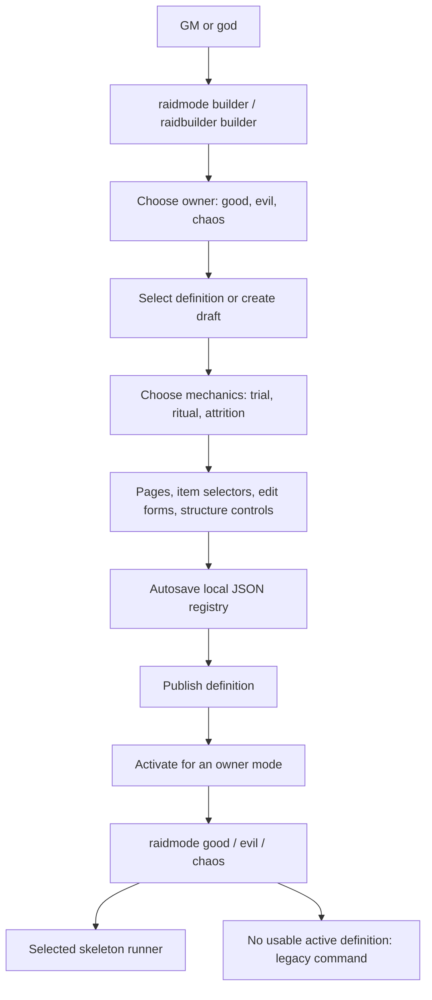

# GM raid builder: current map and proposed advanced mode

Repository inspection: 29 September 2026. The map below records the original implementation and proposed extension. Implementation has since begun: PostgreSQL persistence, personal limits of 5 saved raids / 10 combined drafts, resumable editing and the first Advanced encounter engine are now in the workspace. See [the implementation and usage guide](cogs/raidbuilder/README.md) for current behavior, validation and remaining scope. The original findings below remain as historical context.

## Current flow

The prefix shown in existing help is `$`. `$raidbuilder` is an alias for `$raidmode`; opening the editor requires the `builder` subcommand. The group is restricted to GMs or gods; custom launch subcommands apply their own checks as well. A panel accepts interactions only from its opener.

Owner and mechanics are separate. An Evil-owned raid can use Trial mechanics, for example. Current active routing is global per mode, not per GM or Discord server.

| Area | Current implementation |
| --- | --- |
| Main module | `cogs/raidbuilder/__init__.py`, approximately 6,470 lines |
| Templates | `STARTER_DEFINITIONS`, three published starter definitions; new drafts clone a selected starter |
| Editor | `RaidBuilderPanelView`, three primary selectors and an optional item selector; 900-second timeout |
| Forms | `RaidBuilderFormModal`, up to five inputs per edit |
| Structure | Add, duplicate, delete and reorder supported phases, events, actions and abilities |
| Saving | `_save_registry`, writes `assets/data/raid_builder_registry.json` |
| Loading | `_load_registry` and `normalize_registry`, restore registry and apply defaults |
| Publishing | Changes the definition's status; it does not create an immutable revision |
| Activation | One `active_definition_id` for each of `good`, `evil`, `chaos` |
| Execution | `_launch_mode` -> `_run_custom_definition` -> one of three runners |
| Rewards | Shared `_award_definition_rewards`; fixed/ranged gold and dragon coins, weighted crate pools |
| Existing tests | `tests/test_raidbuilder_default_selection.py`: selection, skeleton variants, rewards and deletion |

### What GMs can create today

| Mechanics | Editable content | Structural limit |
| --- | --- | --- |
| Trial | Join settings, eligibility, timing, phases, weighted trial events, success chances, narrative, art, colors, outcomes and rewards | Elimination/survival loop remains fixed |
| Ritual | Champion/Priest/Follower labels and actions, resources, guardian phases and abilities, progress thresholds, pacing, narrative, art and rewards | Fixed role model and turn resolution; effects come from engine-supported fields/types |
| Attrition | Boss/follower health, damage bands, critical attacks, heal/pulse events, pacing, message pools, art and rewards | Fixed boss-versus-raid loop; no structural editing through the Structure panel |

The option summaries in `MODE_SPECS` are broader descriptions of the frameworks. The actual editable surface is defined by `_builder_page_specs` and its payload/submit handlers.

The legacy `$goodspawn`, `$evilspawn`, and `$chaosspawn` commands remain separate implementations in `elysiatrials`, `raid`, and `horrorraid`. They do not call the builder's routing method. Use `$raidmode good`, `$raidmode evil`, or `$raidmode chaos <boss_hp>` to launch through active builder definitions.

## Persistence findings

Ordinary definition fields, draft/published status and active-mode assignments already save to the local registry. This survives reopening the panel and restarting the process **when the same file is retained**. It does not establish durable storage across container replacement or synchronize separate bot processes.

| Finding | Consequence |
| --- | --- |
| Registry is tracked in Git and written inside the application tree | Runtime content is coupled to deployment files |
| Supplied `units/podman-idlerpg.service` uses `--rm` and mounts config only | That supplied deployment does not retain edits to the registry across container replacement; actual production deployment was not inspected |
| `_load_registry` catches file/JSON errors, then saves defaults | An unreadable/corrupt registry can be replaced; evidence is lost instead of preserved for recovery |
| `_save_registry` writes directly to the destination | An interrupted write can leave partial JSON |
| `_fill_missing` recursively merges starter action dictionaries | Intentionally deleted ritual actions can return on reload |
| JSON is written with `sort_keys=True` | The order of dictionary-backed actions/abilities becomes alphabetical after reload, losing Up/Down edits |
| Registry loads once and whole-file saves use in-memory copies | Separate clusters can overwrite each other's changes; atomic file replacement alone would not fix this |
| GM selection/page/item exist only on the View | Reopening does not resume each GM's editing position |
| Published and draft editing use the same definition object | There is no protected published snapshot; edits can affect configuration referenced by an active run |

Validation: executed the existing schema/storage methods in isolation with temporary files. Confirmed that a deleted champion action returns after normalization, action order changes after saving, and malformed JSON is overwritten with defaults. The live registry was untouched. Full bot/UI tests were not run: the bundled Python lacks Discord and the project's other runtime dependencies.

### Proposed persistence design

Use the bot's existing PostgreSQL infrastructure as the source of truth. JSON remains an import/export format and the initial migration source.

| Record | Contents |
| --- | --- |
| Raid definition | Stable ID, owner mode, creator/editor, mutable draft, schema version, revision number, timestamps |
| Published revision | Immutable validated content, revision ID, publisher and publication time |
| Mode binding | Owner mode -> published revision; initially preserve current global routing |
| GM preferences | GM ID + server/context -> last mode, raid, page, item and simple/advanced view |
| Edit history | Who changed what, when, and which revision can be restored |

Implementation rules:

1. Import the existing registry once, transactionally. Preserve all custom IDs, edits, statuses and mode bindings. Retain the original file and record migration completion. A database failure must report an unavailable builder rather than silently starting an empty registry.
2. Save each submitted change as a transaction. Use expected revision numbers to reject stale simultaneous edits with a clear reload/merge path.
3. Keep collections as ordered lists with stable item IDs, or store explicit ordering. Do not depend on JSON object ordering, especially with PostgreSQL JSONB.
4. Apply versioned schema migrations to required fields. Treat deliberate removal of an action as content, not as a missing default to refill.
5. Autosave GM preferences separately from raid content. Explicit command arguments override remembered selections. Missing/deleted items fall back to a valid page.
6. Separate Save Draft, Validate, Publish and Activate. Each running raid uses a fixed published revision so later edits cannot change its rules.
7. Provide revision history, restore and export in the builder. Show Saved / Save failed and the last successful save time.
8. Keep navigation resumable by opening a fresh panel after timeout or restart. Keeping the original Discord buttons alive is a separate persistent-view feature.

Running raids surviving a restart are also a separate feature: they require durable run state, pending decisions/deadlines, random state and a payout ledger that prevents duplicate rewards. Saving definitions alone must not be presented as run recovery.

Acceptance checks: edit/restart/reopen round trip; retained deleted actions and order; exact migration of active bindings; simultaneous edits from separate processes; database outage without data reset; per-GM preference isolation and stale-item fallback; published revision unaffected by draft edits; container replacement with retained database storage.

## Proposed advanced mode: an encounter composer

The goal is broad freedom to combine supported mechanics. Literal infinite mechanics are not possible without adding engine capabilities, but GMs should be able to invent encounters by combining reusable building blocks without writing Python, JSON or expressions.

### GM-facing workflow

**Create from a template -> arrange encounter cards -> configure rules -> preview -> simulate -> publish.**

Offer a canvas plus an equivalent ordered-list editor. A browser editor is a good fit for complex flows; Discord remains useful for quick edits, previews and running encounters. No browser editor exists in the raid builder today.

| Building block | GM controls | Example |
| --- | --- | --- |
| Encounter flow | Add/connect scenes, battles, trials, votes, puzzles, rituals and endings | Trial -> rescue vote -> boss -> alternate ending |
| Actors and roles | Custom teams, role slots, enemies, adds, companions and target groups | Three players operate wards while others defend |
| Resources | Name a meter, set its initial value, bounds and who owns it | Fear, heat, corruption, ritual stability |
| Abilities | Combine costs, targets, effects, cooldowns and narration | Spend 20 mana, heal an ally, raise corruption by 2 |
| Rules | WHEN event, IF conditions, DO effects, OTHERWISE effects | When a round ends, if all wards are charged, break the shield |
| Targeting | Select self, role, team, random count, lowest HP, marked players or enemies | Strike two random unshielded players |
| Branches | Connect outcomes and specify tie, timeout and failure paths | Spare the guardian to recruit it later |
| Presentation | Text/art slots, variable insertion buttons and embed preview | Insert boss name, current fear and surviving players |
| Templates | Save/reuse phases, mechanics and complete raids | Reuse an enrage phase with different art and values |
| Testing | Run with simulated players; inspect each rule and state change | Explain why a phase triggered or a player died |

A rule should read as a sentence assembled from controls:

> WHEN the round ends, IF at least three players chose **Channel** AND **Corruption** is below 60, DO add 20 to **Ritual Progress** and announce **The wards ignite**. OTHERWISE summon two shades. Repeat at most once per round.

The GM selects each term from controls. Conditions support All / Any / Not groups; numeric values support fixed, range, percent and per-player options. Variable insertion and a guided calculation builder avoid forcing raw formula syntax on GMs.

### Example raid created with those blocks

**The Shattered Moon**:

1. Players choose Warden, Seer or Reaver roles. Each role receives different abilities.
2. A survival trial builds a shared Fear meter; choices determine which route opens.
3. The party votes to rescue captives or destroy a seal. Rescuing adds an ally; destroying weakens the boss.
4. In battle, when the boss crosses 50% HP, the arena changes and two wards appear. Charged wards interrupt the next major attack.
5. If Fear reaches 100, a corruption phase begins. Players can reverse it through a ritual with coordinated choices.
6. The raid ends in victory, negotiated surrender or escape. The chosen ending and rescued captives determine the reward tier.

### Engine work required

- Introduce a fourth `encounter` skeleton that dispatches a versioned encounter graph. Preserve the three existing runners during adoption.
- Build a Discord-independent runtime that evaluates typed triggers, conditions, targets and effects against explicit raid/actor state. Use the same engine for simulations and live runs.
- Define resolution order: action selection, costs, effects, state changes, triggered rules, then victory/defeat checks. Expose priority and once/repeat settings in the editor.
- Add validation for missing targets, unreachable scenes, broken variable references, missing timeout outcomes and repeated transitions that can never terminate. Limit rule execution per tick and repeat counts to keep the bot responsive.
- Use a catalogue of engine-supported blocks. Adding new fundamental mechanics still requires development, but combinations and content are authored by GMs.
- Separate ordinary encounter effects from reward settlement. Validate reward budgets and record settlement once per run.
- Inspect reusable campaign components before implementing shared pieces: `cogs/quests/campaign_content.py` already defines branching nodes, condition groups, state effects and schema versions. Its party/raid semantics must be evaluated before reuse; it is not already a raid engine.
- Paginate/search definitions and items. The current definition selector only exposes the first 25 definitions, and item selectors do not have pagination for large custom collections.

### Suggested delivery order

1. **Persistent editing:** database migration, exact content round trips, revision conflict handling, GM resume, published snapshots and visible save status.
2. **Advanced encounter flow:** scenes, choices, phases, boss encounters, endings, validation and preview. Existing mechanics can be adapted where their join/reward lifecycle allows reuse.
3. **Composable mechanics:** resources, targets, trigger/condition/effect rules, custom roles, abilities and reusable mechanic templates.
4. **Simulation and recovery:** deterministic scenario testing, outcome traces, balance summaries, durable run checkpoints and payout deduplication.

Build a minimal simulator alongside the first rule engine rather than postponing all verification until the final stage. Advanced authoring should remain a proposal until its scope is selected; simply adding more fields to the current forms will not deliver this level of freedom.
